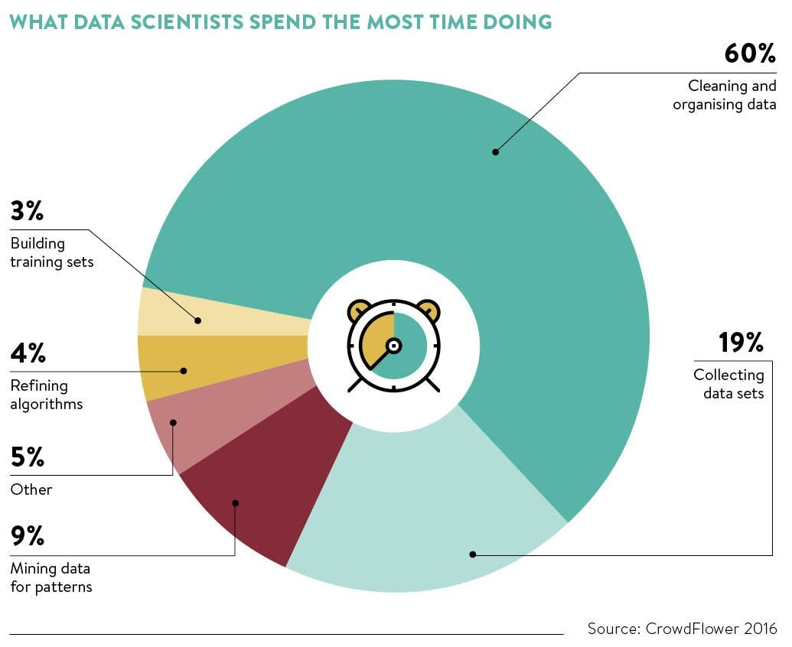

Exploratory data analysis the process of performing preliminary investigations on the data using statistics and graphical representations to unwrap pattern and detect anomalies. It is the most important step in any data science process.

According to a survey conducted by CrowdFlower, Data Scientists spend an average of 60% of their time in Exploring, Cleaning and organizing the data in various grounds. 

A typical data analysis process involves various types of analysis like Univariate Analysis, Bi-variate Analysis, Multivariate Analysis, Missing Value analysis, Variable Interactions etc. The OneNineAI platform can perform all of this analysis and provide a detailed downloadable report in just one click!