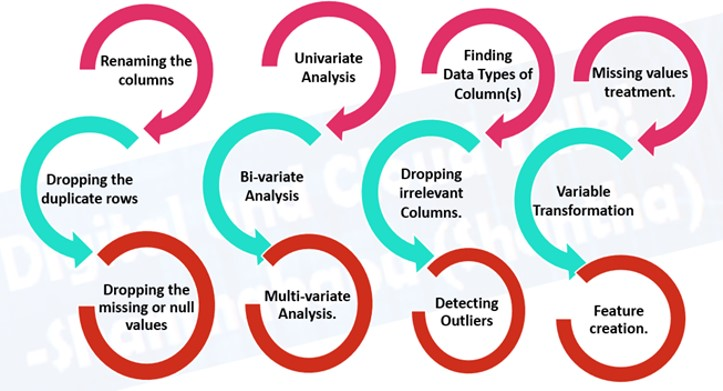

Before one takes the entire dataset as it is in consideration to bake it in the Machine Learning Model, Exploratory data analysis is one step which is unavoidable and time consuming.

It is  the process of performing preliminary investigations on the data using statistics and graphical representations to unwrap pattern and detect anomalies. It is the most important step in any data science process.

According to a survey conducted by CrowdFlower, Data Scientists spend an average of 60% of their time in Exploring, Cleaning and organizing the data in various grounds. 

EDA is a experimenational process which might include lots of steps as shown in the image below

But, a typical data analysis process involves various types of analysis like Univariate Analysis, Bi-variate Analysis, Multivariate Analysis, Missing Value analysis, Variable Interactions etc. These are the standard unavoidable analysis that has to be made on any dataset. 

### Variable Identification
- In this step,  every variable is identifies by discovering its type. 
- According to the needs, the datatype of any variable can be changed
### Univariate Analysis
-  In Univariate Analysis, thr individual characteristics of every feature/variable available in the dataset is studied. There are two types of features – Continuous and Categorical. 
- The table below describes the various graphical techniques that can be applied to analyze them.

| Type Of Variable | Graphical Technique |
| ----------- | ----------- |
| Continuous | Histograms, KDE, Box Plots, Q-Q Plots(specifically for outliers) |
| Categorical | Bar Plot, Pie Chart, Frequency Tables, Word Clouds(specifically for text data) |
### Bi-Variate Analysis
- In Bi-Variate Analysis, relationship between any two variables which can be categorical-continuous, categorical-categorical, or continuous-continuous is studied. 
- The table below explains the various graphical techniques that can be applied to different combinations of data types.

| Type Of Relationship | Graphical Technique |
| ----------- | ----------- |
| Continuous-Continuous | Scatter Plots, Heat Maps, Joint Plots, Pair Plots |
| Categorical-Continuous  | Factor Plot, Swarm Plot, Violin Plot, Strip Plot |
| Categorical-Categorical  | Bar charts, Stacked Bar charts, Crosstabs, Percentage Bar Charts  |
### Missing Value Analysis
- Primary reason for this step is to find out if there is any specific reason why these values are missing and how to treat them. 
- Leaving them untreated hey can interfere with the pattern running in the data which in turn can degrade the model’s performance. 
- Some of the ways in which missing values can be treated are include
    - Filling them with mean *(In case of continuous variables)*, 
    - Filling them with median *(In case of continuous variables)*, 
    - Filling them with mode *(In case of categorical variables)*
    - Filling them with arbitrary values *(In case of both continuous and categorical variables)*
### Outlier Removal 
- An outlier is a data point that deviates significantly from the rest of the data points.
- It is essential to understand the presence of outliers as some of the predictive models are sensitive to them and they have to be treated accordingly.

The OneNineAI platform can perform all of this analysis and provide a detailed downloadable report in just one click!