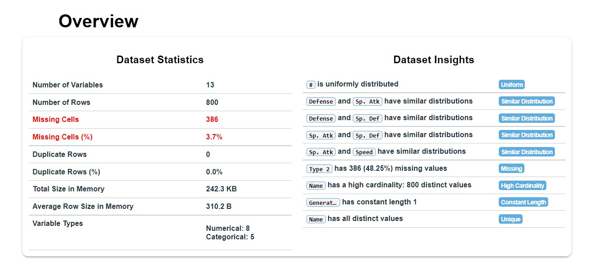
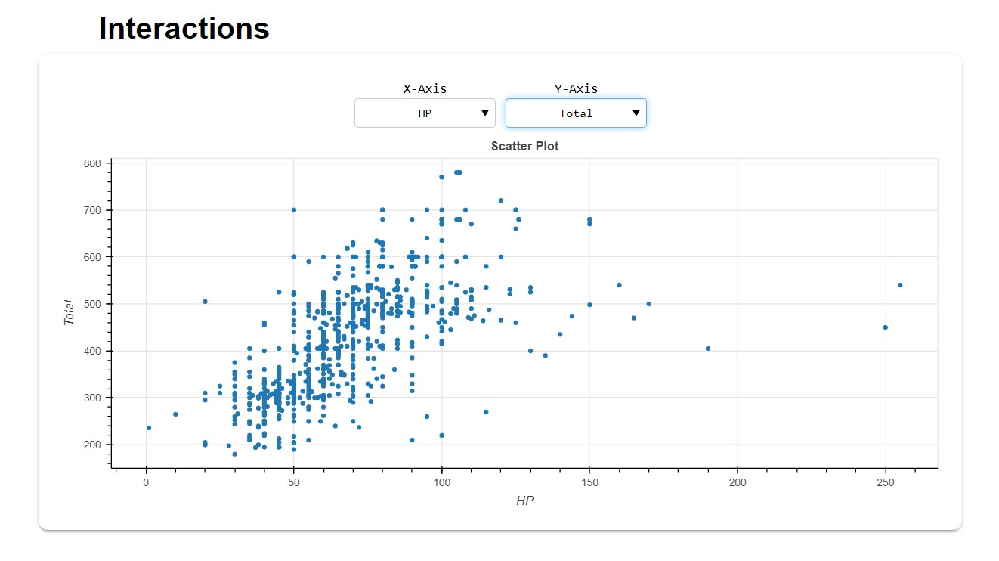

The Exploration Project feature of OneNineAI platform analyses the uploaded data in the following grounds.

1. [Data Overview](/docs/data-analysis/one-click-data-analysis#data-overview)
    * [Dataset Statistics](/docs/data-analysis/one-click-data-analysis#dataset-statistics)
    * [Dataset Insights](/docs/data-analysis/one-click-data-analysis#dataset-insights)
2. [Variable Analysis](/docs/data-analysis/one-click-data-analysis#variable-analysis)
    * [Numeric Variables](/docs/data-analysis/one-click-data-analysis#numeric-variables)
        * [Summary Statistics](/docs/data-analysis/one-click-data-analysis#summary-statistics)
        * [KDE Plot](/docs/data-analysis/one-click-data-analysis#kde-plot)
        * [Normal Q-Q Plot](/docs/data-analysis/one-click-data-analysis#normal-q-q-plot)
        * [Box Plot](/docs/data-analysis/one-click-data-analysis#box-plot)
    * [Categorical Variables](/docs/data-analysis/one-click-data-analysis#categorical-variables)
        * [Stats](/docs/data-analysis/one-click-data-analysis#stats)
        * [Pie Chart](/docs/data-analysis/one-click-data-analysis#pie-chart)
        * [Word Cloud](/docs/data-analysis/one-click-data-analysis#word-cloud)
        * [Word Frequency](/docs/data-analysis/one-click-data-analysis#word-frequency)
        * [Word Length](/docs/data-analysis/one-click-data-analysis#word-length)
3. [Interactions](/docs/data-analysis/one-click-data-analysis#interactions)
4. [Correlations](/docs/data-analysis/one-click-data-analysis#correlations)
    * [Pearson Correlation](/docs/data-analysis/one-click-data-analysis#pearson-correlation)
    * [Spearman Correlation](/docs/data-analysis/one-click-data-analysis#spearman-correlation)
    * [KendallTau Correlation](/docs/data-analysis/one-click-data-analysis#kendalltau-correlation)
5. [Missing Value Analysis](/docs/data-analysis/one-click-data-analysis#missing-value-analysis)

 

## Data Overview
---
- #### Dataset Statistics
    - Includes  high level statistics about the data such as  Dimension of the data, memory size, variable types etc.
- #### Dataset Insights
    - Includes auto-generated intuitive verbal insights for easy and quick understanding

## Variable Analysis
---
### Numeric Variables
In case of numeric variables, the following insights can be obtained.
- #### Summary Statistics
    - Provides important statistical information about the variable. It includes quantile statistics such as Minimum, Maximum, Q1, Q3, 5th Percentile, 95th percentile, Median, Range and IQR and Descriptive statistics  such as Mean, Standard Deviation, Variance, Sum, Skewness, Kurtosis, Coefficient of Variation and the total sum
- #### KDE Plot
    - A KDE plot is nothing but the Kernel Density Plot which visualizes the distribution of observations. 
    - It displays the probability density at different values in a continuous variable
- #### Normal Q-Q Plot
    - A Q-Q plot is a scatter plot created by plotting two sets of quantiles against one another. 
    - If both sets of quantiles came from the same distribution, we should see the points forming a line that's roughly straight
- #### Box Plot
    - The Box plot represents the summary statistics of the data in a graphical manner.

import Tabs from '@theme/Tabs';
import TabItem from '@theme/TabItem';
import sum_stats from '../../static/img/docs/eda/stats.jpg';
import kde from '../../static/img/docs/eda/kde.jpg';
import qq from '../../static/img/docs/eda/qq.jpg';
import box from '../../static/img/docs/eda/box.jpg';

<Tabs
  defaultValue="sum_stats"
  values={[
    {label: 'Summary Statistics', value: 'sum_stats'},
    {label: 'KDE Plot', value: 'kde'},
    {label: 'Normal Q-Q Plot', value: 'qq'},
    {label: 'Box Plot', value: 'box'},
  ]}>
  <TabItem value="sum_stats">
     
    
  </TabItem>
  <TabItem value="kde">    
     
    
  </TabItem>
  <TabItem value="qq">
     
    
  </TabItem>
  <TabItem value="box">
     
    
  </TabItem>
</Tabs>

### Categorical Variables
In case of categorical variables, the following insights can be obtained
- #### Stats
    - Includes Length stats, Sample Stats and Letter Stats
- #### Pie Chart
    - A frequency Pie chart representing the frequency of each category
- #### Word Cloud
    - A visual representation of words from the categorical variable where the font size of the word is proportional to the frequency
- #### Word Frequency
    - A bar plot representing the frequency of each category in descending order
- #### Word Length
    - A bar plot of word lengths against the frequency

import stats_cat from '../../static/img/docs/eda/stats_cat.jpg';
import pie from '../../static/img/docs/eda/pie.jpg';
import word_cloud from '../../static/img/docs/eda/word_cloud.jpg';
import word_frequency from '../../static/img/docs/eda/word_frequency.jpg';
import word_length from '../../static/img/docs/eda/word_length.jpg';

<Tabs
  defaultValue="stats_cat"
  values={[
    {label: 'Stats', value: 'stats_cat'},
    {label: 'Pie Chart', value: 'pie'},
    {label: 'Word Cloud', value: 'word_cloud'},
    {label: 'Word Frequency', value: 'word_frequency'},
    {label: 'Word Length', value: 'word_length'},
  ]}>
  <TabItem value="stats_cat">
     
    
  </TabItem>
  <TabItem value="pie">    
     
    
  </TabItem>
  <TabItem value="word_cloud">
     
    
  </TabItem>
  <TabItem value="word_frequency">
     
    
  </TabItem>
  <TabItem value="word_length">
     
    
  </TabItem>
</Tabs>

## Interaction
---
- Dynamic Interactive scatter plots between numeric variables. A scatter plot basically uses dots to represent values for two different numeric variables. The position of each dot on the horizontal and vertical axis indicates values for an individual data point
 

## Correlations
---
- Correlation denotes the extent of association between the variables. 
- Correlation can be measured using Correlation coefficients whose value range between -1 to 1. 
- When the correlation coefficient is -1, then it means that the variables are strongly inversely associated (When one increases, the other decreases) . 
- A correlation coefficient of 1 means that the variables are strongly directly associated (When one increases, the other also increases). 
- A correlation of 0 means that there is no correlation or association between the variables. There are a lot of ways in which we can calculate the correlation coefficient. 
- In this report, Correlation analysis with three different types of formulas can be obtained.
- #### Pearson Correlation
    - This is the most common form of correlation which measures the linear relationship. 
    - Suitable for variables that follow normal distribution.
- #### Spearman Correlation
    - It is a non-parametric test that measures a monotonic relationship using ranked or ordinal data. 
    - Does not require continuous data.
- #### KendallTau Correlation
    - Similar to Spearman, Kendall’s is non-parametric meaning that it does not require the two variables to fall into a bell curve. 
    - Kendall’s also does not require continuous data.
## Missing Value Analysis
---
- The number of missing values in each variable are represented using the various forms of visualizations such as Bar Chart, Spectrum Chart, Heat Map and Dendrogram
- #### Bar Chart
    - In general, A bar chart represents  data with rectangular bars where the heights or lengths proportional to the values that they represent.
    - Here, the count of of missing values are represented in terms of percentage
- #### Spectrum 
    - Similar to Bar chart, Spectrum also displays the count of missing values in a two dimensional space against the row indices

- #### Heat Map
    - Generally, A heat map is a data visualization technique that shows magnitude of a missing values as color in two dimensions
- #### Dendrogram
    - The dendrogram is a visual representation of the compound missing data. 
    - The individual compounds are arranged along the bottom of the dendrogram and referred to as leaf nodes.
    -  Compound clusters are formed by joining individual compounds or existing compound clusters with the join point referred to as a node

import bar from '../../static/img/docs/eda/bar.jpg';
import spectrum from '../../static/img/docs/eda/spectrum.jpg';
import heat from '../../static/img/docs/eda/heat.jpg';
import dendrogram from '../../static/img/docs/eda/dendrogram.jpg';

<Tabs
  defaultValue="bar"
  values={[
    {label: 'Bar Chart', value: 'bar'},
    {label: 'Spectrum Chart', value: 'spectrum'},
    {label: 'Heat Map', value: 'heat'},
    {label: 'Dendrogram', value: 'dendrogram'},
  ]}>
  <TabItem value="bar">
     
    
  </TabItem>
  <TabItem value="spectrum">    
     
    
  </TabItem>
  <TabItem value="heat">
     
    
  </TabItem>
  <TabItem value="dendrogram">
     
    
  </TabItem>
</Tabs>
