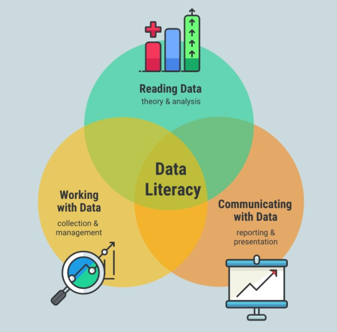

---
## Introduction

In today's age, Data is an integral part of all of our lives. According to a report published by Statista, The total amount of data generated over the year of 2021 is around 79 Zettabytes and the estimated amount of data to be generated by 2022 is around 97 Zettabytes and by 2025, the estimated amount is around 181 Zettabytes. 

:::info Fun Fact

One Zettabyte  is equivalent to a trillion GigaBytes!

:::

But do we fully understand this data? And furthermore, How can we use it in the best way?

Well, this is where Data Literacy comes in.

## What is Data Literacy?

Data Literacy is nothing but  the ability to read data, work with data, and communicate about data by putting it in proper context. Data Literacy is not just understanding and working with numbers, or numeracy. 
It is the overall understanding of source of the data, the applications of the data and the validity of the data. 
It is an intersection of Data Reading skills, Data management skills and data representation skills.

## Why is Data Literacy Important?

When used properly, this abundant data can help us make clear data driven factful decisions to improve in both business and other domestic contexts. Almost all the companies in today's era are giving huge importance to data literacy since data driven decision making has a direct impact with growth and advancement of the business.
Without data literacy, businesses can’t thrive in today’s analytics economy nor can it drive any cultural change toward leading with data across their organizations.