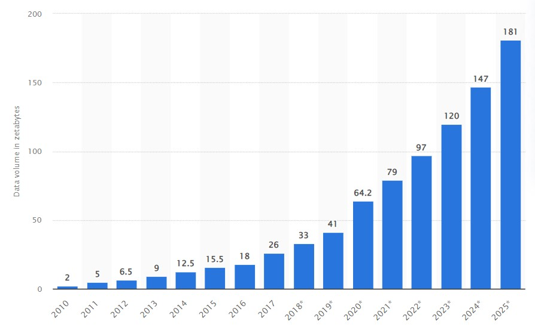

---
# Data Literacy
---

In today's age, Data is an integral part of all of our lives. According to a report published by Statista, The total amount of data generated over the year of 2021 is around 79 Zettabytes and the estimated amount of data to be generated by 2022 is around 97 Zettabytes and by 2025, the estimated amount is around 181 Zettabytes. 

Fun Fact : 1 Zettabyte  is equivalent to a trillian GigaBytes!

But do we fully understand this data? And furthermore, How can we use it in the best way?

Well, this is where Data Literacy comes in.

## What is Data Literacy?

Data Literacy is nothing but  the ability to read data, work with data, and communicate about data by putting it in proper context.