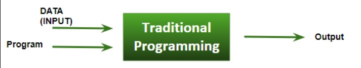
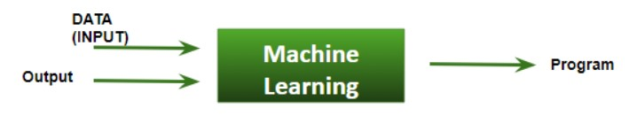
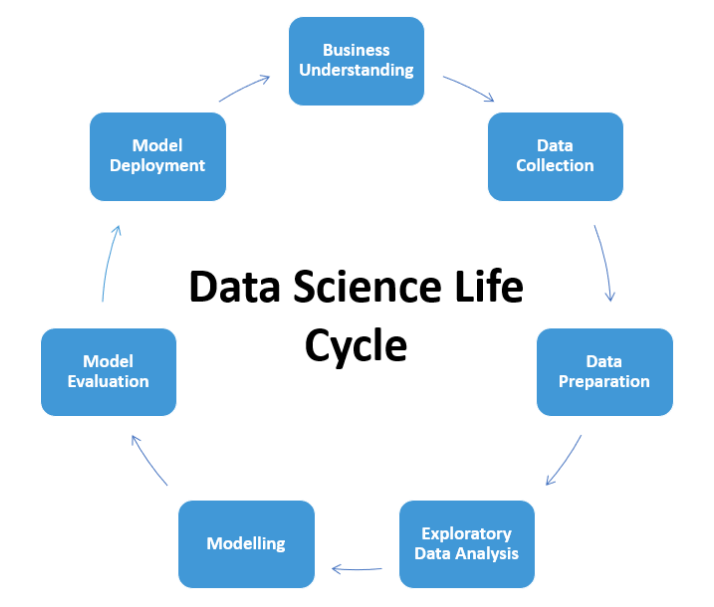

## What is Data Science?

As people rightly say, Data is the new electricity. Data science is the idea of using various statistical techniques to analyze and draw insights from the data. In other words, Data science is a deep study of the massive amount of data, which involves extracting meaningful insights from the data that is processed using the scientific method, different technologies, and algorithms.

Most times, the word Data Science is also associated with Machine Learning and Artificial Intelligence

## What is AI and Machine Learning?

Artificial intelligence (AI) is a wide-ranging branch of computer science that is concerned with building smart machines capable of performing tasks that typically require human intelligence and Machine Learning is a subset of AI that deals with allowing software applications to become more accurate at predicting outcomes without being explicitly programmed to do so.
Here is the table that gives an overall idea of why to choose Machine Learning over traditional programmatic way of problem solving.

| Traditional Programming                                                                                             | Machine Learning                                                                                                                                               |
| ------------------------------------------------------------------------------------------------------------------- | -------------------------------------------------------------------------------------------------------------------------------------------------------------- |
| We feed in `DATA (Input)` + `PROGRAM (logic)`, run it on machine and get output                                     | We feed in `DATA(Input)` + `OUTPUT`, run it on machine during training and the machine creates its own `PROGRAM (logic)`, which can be evaluated while testing |
|  |                                                                         |

## Data Science Lifecycle

A typical data science lifecycle involves the following process

### 1. Business Understanding

Understanding the domain of business is vital in for the data science process as the entire lifecycle revolves around the business goal.

### 2. Data Understanding

Once there is a clear picture about the business goal, the second most important thing is to understand the data. This step also involves the data collection process with respect to the previously set business goals and the data defining process where we properly define the data type, the data structure and many other information.

### 3. Data Preparation

This step can also be referred as the Data Cleaning or the Data Wrangling step which involves various activities such as selecting the relevant data, cleaning it, handling the missing values by either removing them or imputing them with relevant data and checking for outliers and handling them. 
Constructing new data or a feature from existing ones by using feature engineering also falls under this category.

### 4. Data Modeling

This step is considered as the heart of the Data science lifecycle which involves building a Machine Learning or Deep Learning model from the data obtained in the previous step. The model building process begins with choosing the right kind of model for the problem, whether the problem is a classification problem, or a regression problem, or a clustering problem, or a time-series problem. Once the type of model is chosen, the next job is to experiment with the different kinds of models available for that particular type, perform parameter tuning and figure out the best model that gives the most accurate results. There are lots of measures with which the performance of the model can be evaluated and these differ from type to type.

### 5. Model Deployment

This is the final step where the built and validated Machine Learning/Deep learning model is served to the end-user for them to use it effortlessly. There are multiple ways of deploying the models. It is the job of the data scientist to choose the right format and channel for the deployment.