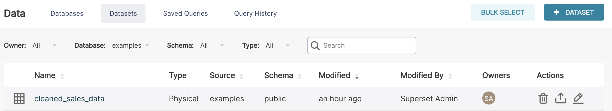
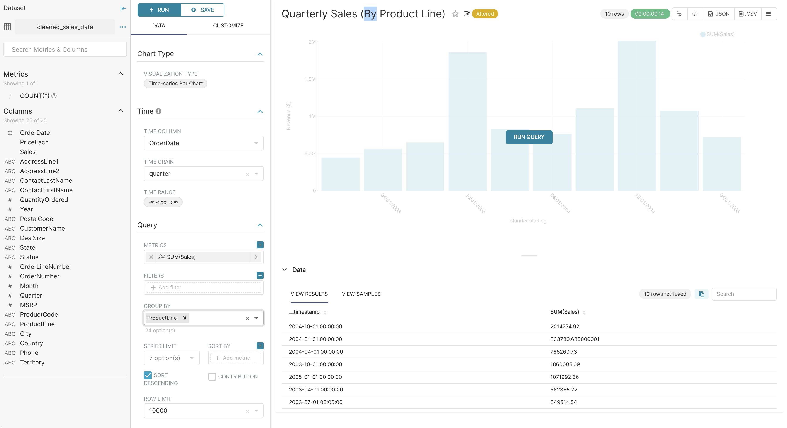
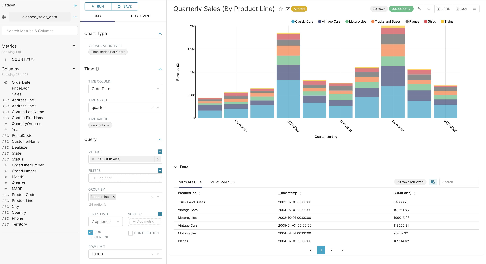

## Interfaces for Exploring Data

Data Visualisation has 2 main interfaces for exploring data:

  - Explore: no-code viz builder. Select your dataset, select the chart, customize the appearance, and publish.
  - SQL Lab: SQL IDE for cleaning, joining, and preparing data for Explore workflow

We'll focus on the Explore view for creating charts right now. To start the Explore workflow from the Datasets tab, start by clicking the name of the dataset that will be powering your chart.

You're now presented with a powerful workflow for exploring data and iterating on charts.

  - The Dataset view on the left-hand side has a list of columns and metrics, scoped to the current dataset you selected.
  - The Data preview below the chart area also gives you helpful data context.
  - Using the Data tab and Customize tabs, you can change the visualization type, select the temporal column, select the metric to group by, and customize the aesthetics of the chart.

As you customize your chart using drop-down menus, make sure to click the Run button to get visual feedback.

In the following screenshot, we craft a grouped Time-series Bar Chart to visualize our quarterly sales data by product line just be clicking options in drop-down menus.

