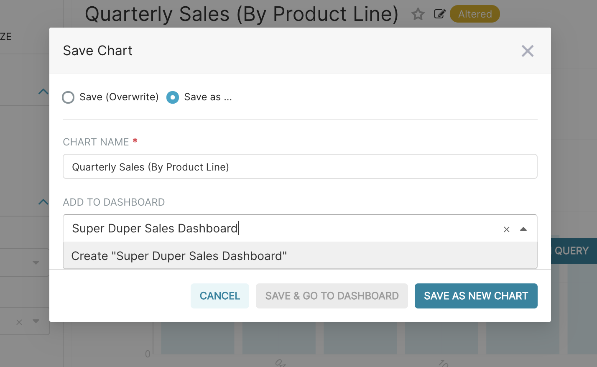
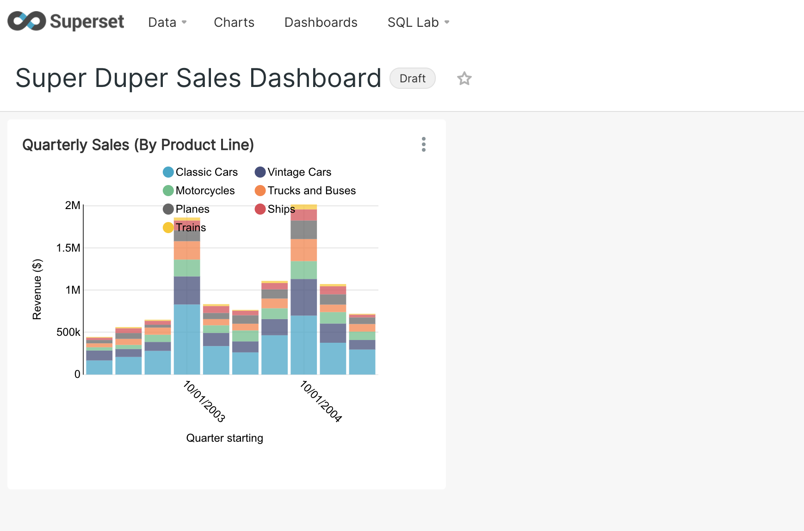

To save your chart, first click the Save button. You can either:

  - Save your chart and add it to an existing dashboard
  - Save your chart and add it to a new dashboard

In the following screenshot, we save the chart to a new "Superset Duper Sales Dashboard":

To publish, click **Save and goto Dashboard**.

Behind the scenes, Superset will create a slice and store all the information needed to create your chart in its thin data layer (the query, chart type, options selected, name, etc).

To resize the chart, start by clicking the pencil button in the top right corner.