## Types of Data Visualisations

### 1. Line Charts
 - A line chart is a graphical representation of an asset's historical price action that connects a series of data points with a continuous line. This is the most basic type of chart used in finance, and it typically only depicts a security's closing prices over time. &nbsp; &nbsp; &nbsp; &nbsp; &nbsp; &nbsp; &nbsp; &nbsp; &nbsp; &nbsp; &nbsp; &nbsp; &nbsp; &nbsp; &nbsp; &nbsp; &nbsp; &nbsp; &nbsp; &nbsp; &nbsp; &nbsp; &nbsp; &nbsp; &nbsp; &nbsp; &nbsp; &nbsp;
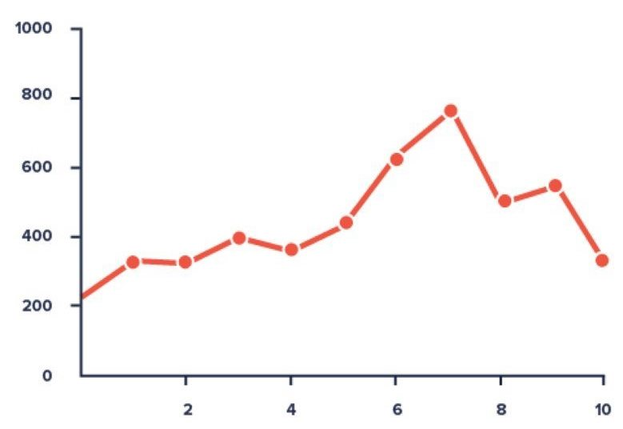
### 2. Big Number with Trendline
 - Big Number with Trendline chart is a visualization that is used to place focus on a key performance indicator with associated percentile changes.
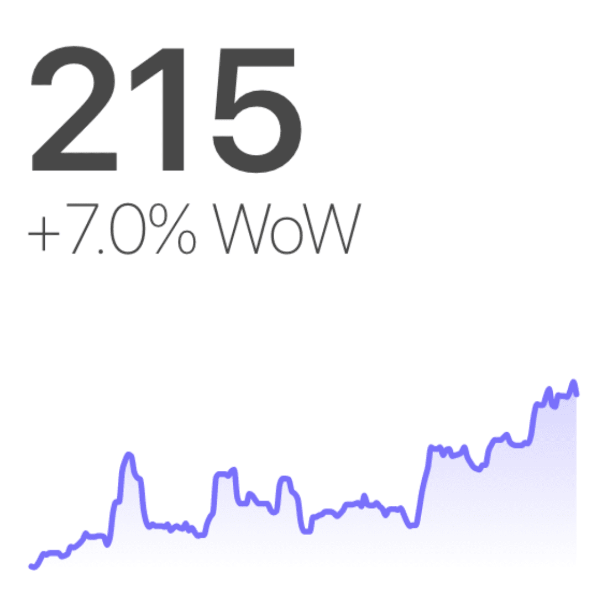
### 3. Table
 - A table chart is a means of arranging data in rows and columns. The use of tables is pervasive throughout all communication, research and data analysis.
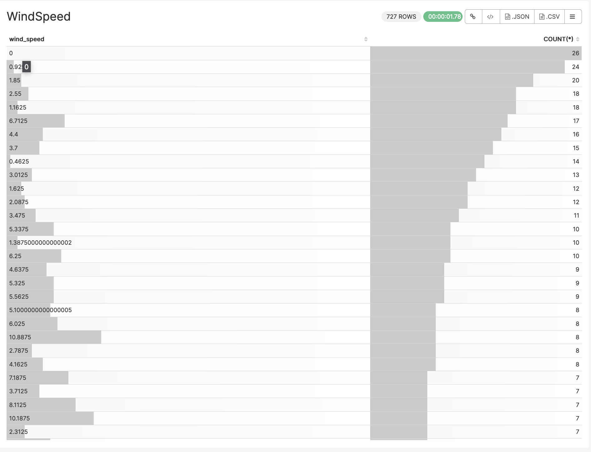
### 4. Bar Chart
 - A bar chart or bar graph is a chart or graph that presents categorical data with rectangular bars with heights or lengths proportional to the values that they represent. The bars can be plotted vertically or horizontally. A vertical bar chart is sometimes called a column chart.
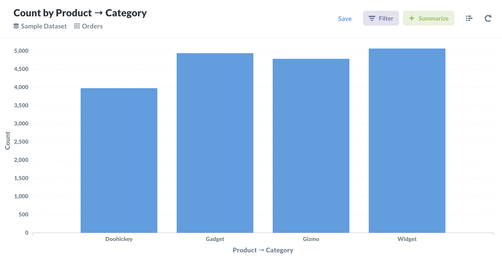
### 5. Area Chart
 - An area chart or area graph displays graphically quantitative data. It is based on the line chart. The area between axis and line are commonly emphasized with colors, textures and hatchings.
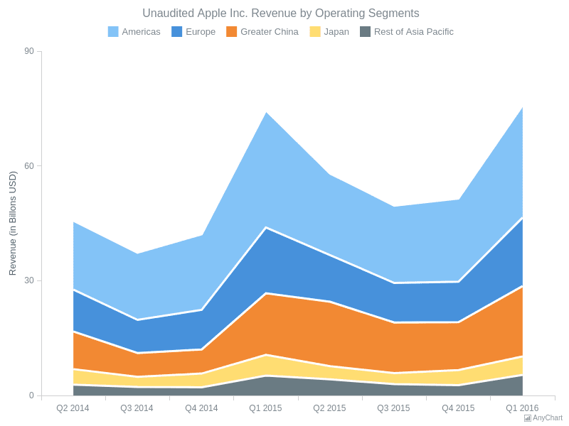
### 6. Time-Series Bar Chart
 - Time Series Bar Charts are used to show the changes in a metric over time as a series of bars. You can also graph multiple series this way, to show the breakdown of a metric across dimensions, and how the values vary over time.

### 7. Pie Chart
 - A pie chart is a circular statistical graphic, which is divided into slices to illustrate numerical proportion. In a pie chart, the arc length of each slice, is proportional to the quantity it represents. &nbsp; &nbsp; &nbsp; &nbsp; &nbsp; &nbsp; &nbsp; &nbsp; &nbsp; &nbsp; &nbsp; &nbsp; &nbsp; &nbsp; &nbsp; &nbsp; &nbsp; &nbsp; &nbsp; &nbsp; &nbsp; &nbsp;
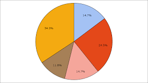
### 8. Time-Series Table
 - A table is comprised of one or more related time series, each of which describes a single summary statistic (e.g., the count of occupied housing units) measured at multiple times (e.g., each census year from 1970 to 2010) at selected geographic levels (e.g., states or counties). &nbsp; &nbsp; &nbsp; &nbsp; &nbsp; &nbsp; &nbsp; &nbsp; &nbsp; &nbsp; &nbsp; &nbsp; &nbsp; &nbsp; &nbsp; &nbsp; &nbsp; &nbsp; &nbsp; &nbsp; &nbsp; &nbsp;
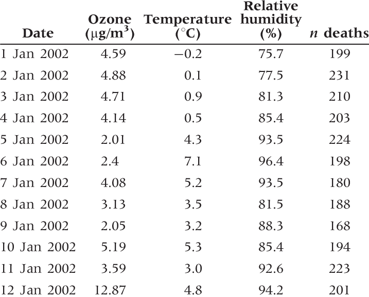
### 9. Pivot Table
 - A PivotTable is a powerful tool to calculate, summarize, and analyze data that lets you see comparisons, patterns, and trends in your data.
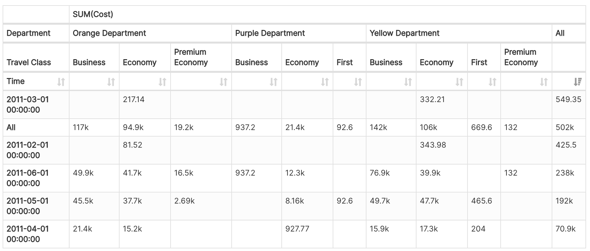
### 10. Histogram
 - A histogram is a graphical representation that organizes a group of data points into user-specified ranges.
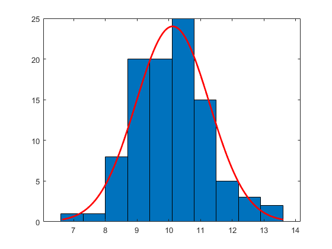
### 11. Dual Line Chart
 - A dual-line chart (also referred to as a dual-axis chart) is an extension of the line chart with a notable exception: It allows for more than one measure to be represented with two different axis ranges. This is done by assigning the right and left sides of the vertical axis with different measures. &nbsp; &nbsp; &nbsp; &nbsp; &nbsp; &nbsp; &nbsp; &nbsp; &nbsp; &nbsp; &nbsp; &nbsp; &nbsp; &nbsp;
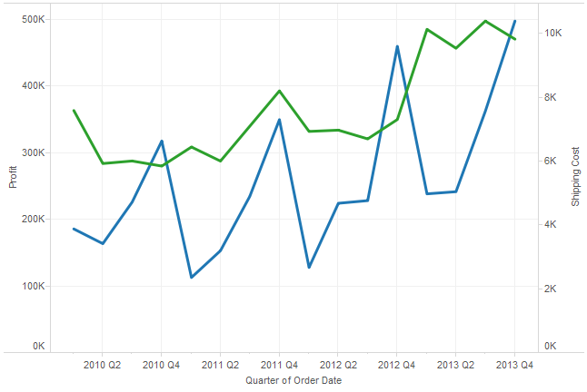
### 12. Multi-Line Chart
 - The multi-series line chart is used to visualize trends and relationships in multiple datasets. It consists of various data points connected using line segments, where each point represents a single value.
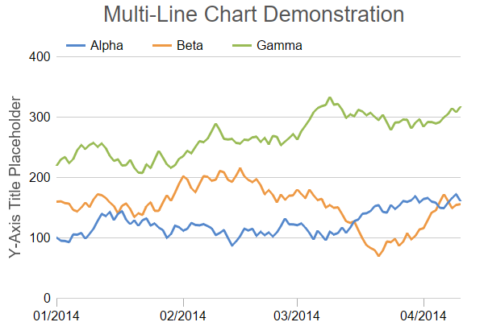
### 13. Sankey Diagram
 - A sankey diagram is a visualization used to depict a flow from one set of values to another. The things being connected are called nodes and the connections are called links. Sankeys are best used when you want to show a many-to-many mapping between two domains (e.g., universities and majors) or multiple paths through a set of stages.
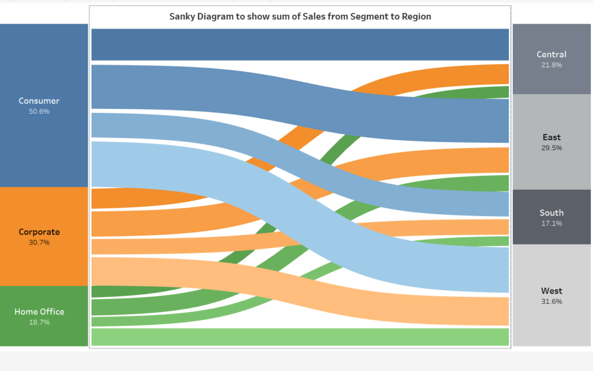
### 14. Treemap
 - A treemap is a visualization that displays hierarchically organized data as a set of nested rectangles, parent elements being tiled with their child elements. The sizes and colors of rectangles are proportional to the values of the data points they represent.
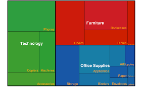
### 15. Box Plot
 - A box plot or boxplot (also known as box and whisker plot) is a type of chart often used in explanatory data analysis. Box plots visually show the distribution of numerical data and skewness through displaying the data quartiles (or percentiles) and averages.

### 16. Word Cloud
 - A Word Cloud chart is a visual representation of text data in which the importance or frequency of individual words is represented using font size and color. &nbsp; &nbsp; &nbsp; &nbsp; &nbsp; &nbsp; &nbsp; &nbsp; &nbsp; &nbsp; &nbsp; &nbsp; &nbsp; &nbsp; &nbsp; &nbsp; &nbsp; &nbsp; &nbsp; &nbsp; &nbsp; &nbsp; &nbsp; &nbsp; &nbsp; &nbsp; &nbsp; &nbsp;
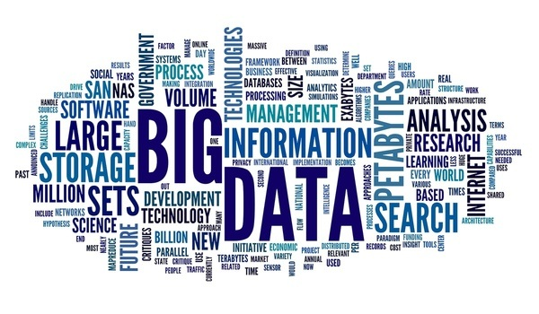
### 17. Calendar Heatmap
 - A calendar heatmap uses colored cells, to show relative number of events for each day in a calendar view. Days are arranged into columns by weeks and grouped by months and years. This enables us to quickly identify daily and weekly patterns, and to recognize anomalies within the data.
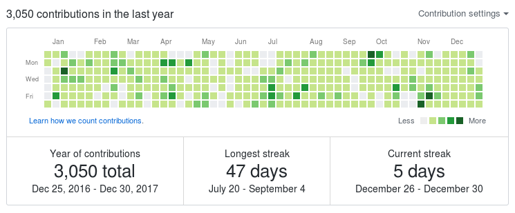
### 18. Nightingale Rose Chart
 - Nightingale Rose Chart (also known as Coxcomb Chart or Polar Area Diagram) is a peculiar combination of the Radar Chart and Stacked Column Chart types of data visualization. It has the same advantages as a Stacked Column Chart and is helpful when working with cyclic data.
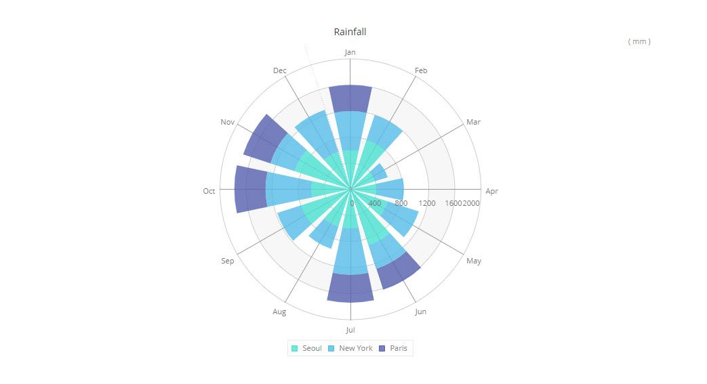
### 19. Bubble Chart
 - A bubble chart is used to visualize a data set with two to four dimensions. The first two dimensions are visualized as coordinates, the third as color and the fourth as size.
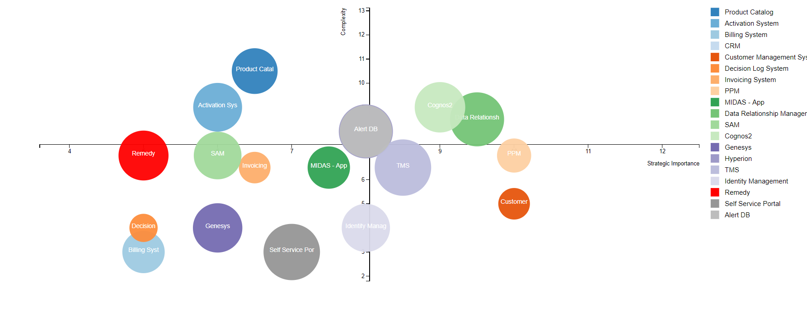
### 20. Chord Diagram
 - A chord diagram represents flows or connections between several entities (called nodes). Each entity is represented by a fragment on the outer part of the circular layout. Then, arcs are drawn between each entities. The size of the arc is proportional to the importance of the flow. &nbsp; &nbsp; &nbsp; &nbsp; &nbsp; &nbsp; &nbsp; &nbsp; &nbsp; &nbsp; &nbsp; &nbsp; &nbsp; &nbsp; &nbsp; &nbsp; &nbsp; &nbsp; &nbsp; &nbsp; &nbsp; &nbsp; &nbsp; &nbsp; &nbsp; &nbsp; &nbsp; &nbsp; &nbsp; &nbsp; &nbsp; &nbsp; &nbsp; &nbsp; &nbsp; &nbsp; &nbsp; &nbsp; &nbsp; &nbsp; &nbsp; &nbsp; &nbsp; &nbsp; &nbsp; &nbsp; &nbsp; &nbsp; &nbsp; &nbsp; &nbsp; &nbsp; &nbsp; &nbsp; &nbsp; &nbsp;
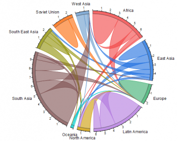

### And much more...