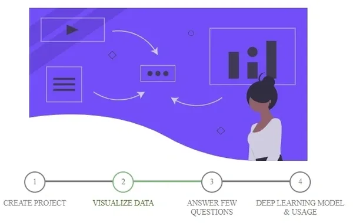

---
# Discovery Projects Intro
---

## What are Deep Learning Networks?
  - Deep Learning is a subfield of machine learning concerned with algorithms inspired by the structure and function of the brain called artificial neural networks.
  - Deep Learning networks are the mathematical models that are used to mimic the human brains as it is meant to solve the problems using unstructured data, these mathematical models are created in form of neural network that consists of neurons. The neural network is divided into three major layers that are input layer( first layer of neural network), hidden layer (all the middle layer of neural network) and the output layer(last layer of the neural network.). Based upon these types of data we will deal with these neural networks that are classified as a feed-forward neural network, CNN, RNN, Modular neural network, etc. 
  
## Discovery Project

Discovery project is an easy way to build highly customized neural networks without any coding. This feature takes in your dataset and just by answering a few questions through our wizard, you will obtain valuable insights to your data and build a deep learning model usually created by a data scientist. This allows non experts to go from an idea to model in minutes.

&nbsp; &nbsp; &nbsp; &nbsp; &nbsp; &nbsp; &nbsp; &nbsp; &nbsp;&nbsp; &nbsp; &nbsp; &nbsp; &nbsp; &nbsp; &nbsp; &nbsp; &nbsp; 
