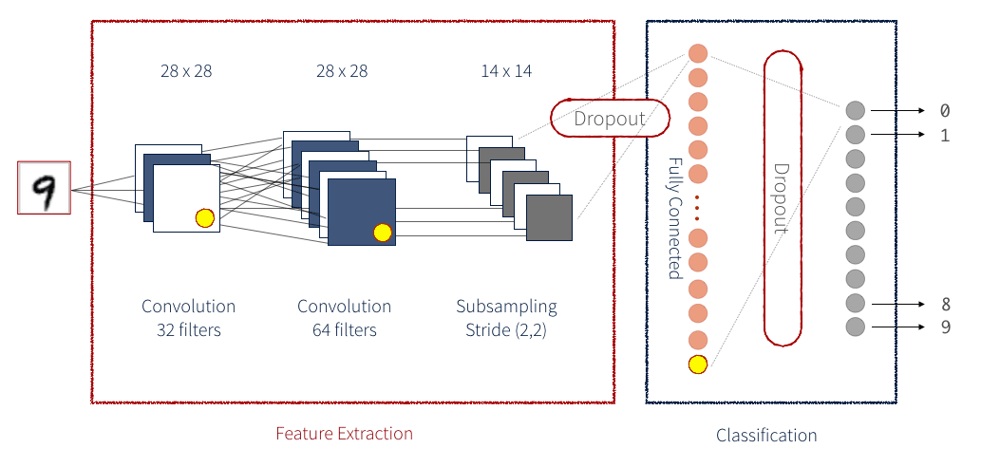
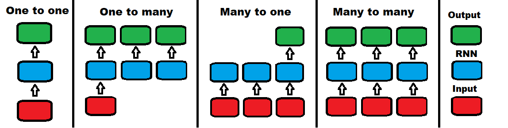
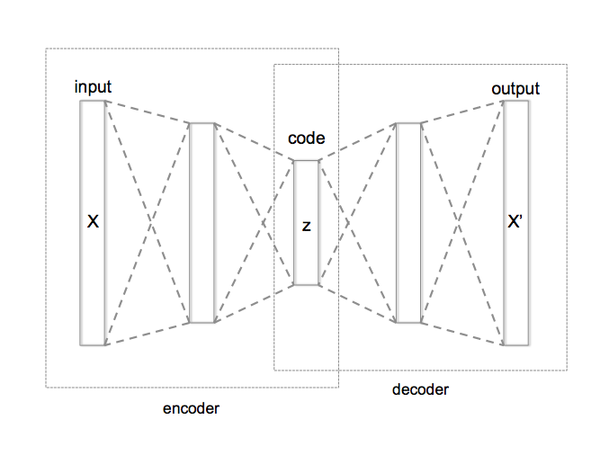
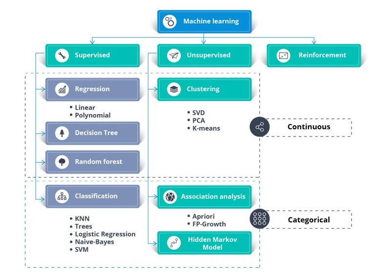

---
# Types of Deep Learning Models
---
Deep Learning Models are broadly divided into 2 types:

## 1. **Supervised Deep Learning Models** 
Supervised Deep Learning Model are those that are trained using supervised data.It is defined by its use of labeled datasets to train algorithms that to classify data or predict outcomes accurately. As input data is fed into the model, it adjusts its weights until the model has been fitted appropriately, which occurs as part of the cross validation process. Supervised learning helps organizations solve for a variety of real-world problems at scale.

### 1.1. **Classic Neural Networks (Multilayer Perceptrons)**
 Classic Neural Networks can also be referred to as Multilayer perceptrons. A Multilayer perceptron is the classic neural network model consisting of more than 2 layers. &nbsp; &nbsp; &nbsp; &nbsp; &nbsp; &nbsp; &nbsp; &nbsp; &nbsp; &nbsp;

 - When to use:
    1. Tabular dataset formatted in rows and columns (CSV files).
    2. Classification and Regression problems where a set of real values is given as the input.
    3. A higher level of flexibility is required in your model. ANNs can be applied to different types of data.  

### 1.2. **Convolutional Neural Networks (CNNs)**
 A more capable and advanced variation of classic artificial neural networks, a Convolutional Neural Network (CNN) is built to handle a greater amount of complexity around pre-processing, and computation of data.
 
 &nbsp; &nbsp; &nbsp; &nbsp; &nbsp; &nbsp; &nbsp; &nbsp; &nbsp;

 - When to use:
    1. Image Datasets (including OCR document analysis).
    2. Input data is a 2-dimensional field but can be converted to 1-dimensional internally for faster processing.
    3. When the model may require great complexity in calculating the output.

### 1.3. **Recurrent Neural Networks (RNNs)** 
Recurrent Neural Networks (RNNs) were invented to be used around predicting sequences. LSTM (Long short-term memory) is a popular RNN algorithm with many possible use cases.

- When to use:
    1. One to one: a single input mapped to a single output.
    e.g — Image Classification
    2. One to many: a single input mapped to a sequence of outputs
    e.g — Image captioning (multiple words from a single image)
    3. Many to one: A sequence of inputs produces a single output
    e.g — Sentiment Analysis (binary output from multiplewords)
    4. Many to many: A sequence of inputs produces a sequence ofoutputs.
    e.g — Video classification (splitting the videointo frames and labeling each frame separately)
    
## 2. **Unsupervised Deep Learning Models** 
Unsupervised Deep Learning Models is a machine learning method in which patterns inferred from the unlabeled input data. The goal of unsupervised learning is to find the structure and patterns from the input data. Unsupervised learning does not need any supervision. Instead, it finds patterns from the data by its own.

### 2.1. **Self-Organizing Maps**
Self-Organizing Maps or SOMs work with unsupervised data and usually help with dimensionality reduction (reducing how many random variables you have in your model).
- When to use:
    1. When data provided does not contain an output or a Y column.
    2. Exploration projects to understand the framework behind a dataset.
    3. Creative projects (Music/Text/Video produced by AI).
    4. Dimensionality reduction for feature detection.
    
### 2.2. **Boltzmann Machines**
Boltzmann machines don’t follow a certain direction. All nodes are connected to each other in a circular kind of hyperspace like in the image. A Boltzmann machine can also generate all parameters of the model, rather than working with fixed input parameters.
- When to use:
    1. When monitoring a system (since the BM will learn to regulate)
    2. Building a binary recommendation system
    3. When working with a very specific set of data

### 2.3. **AutoEncoders** 
Autoencoders work by automatically encoding data based on input values, then performing an activation function, and finally decoding the data for output. A bottleneck of some sort imposed on the input features, compressing them into fewer categories. Thus, if some inherent structure exists within the data, the autoencoder model will identify and leverage it to get the output.&nbsp; &nbsp; &nbsp; &nbsp; &nbsp; &nbsp; &nbsp; &nbsp; &nbsp; &nbsp; 

- When to use:
    1. Dimensionality reduction/Feature detection
    2. Building powerful recommendation systems (more powerful than BM)
    3. Encoding features in massive datasets

## 3. Differences between Supervised and Unsupervised Deep Learning
| Supervised Learning | Unsupervised Learning |
| ------------------- | --------------------- |
| Supervised learning algorithms are trained using labeled data. | Unsupervised learning algorithms are trained using unlabeled data. |
| Supervised learning model takes direct feedback to check if it is predicting correct output or not. | Unsupervised learning model does not take any feedback. |
| Supervised learning model predicts the output. | Unsupervised learning model finds the hidden patterns in data. |
| In supervised learning, input data is provided to the model along with the output. | In unsupervised learning, only input data is provided to the model. |
| Supervised learning can be categorized in Classification and Regression problems. | Unsupervised Learning can be classified in Clustering and Associations problems. |

&nbsp; &nbsp; &nbsp; &nbsp; &nbsp; &nbsp; &nbsp; &nbsp;