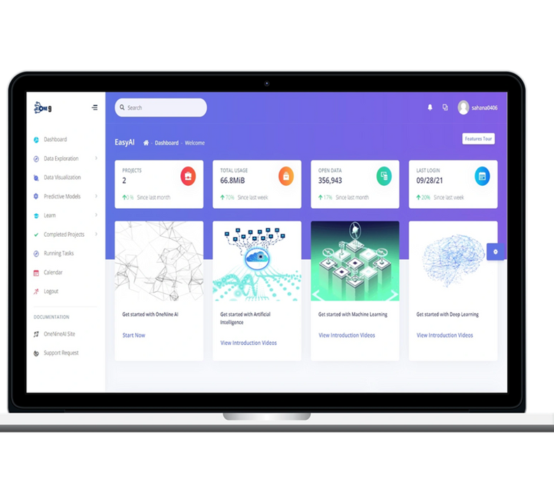

&nbsp; &nbsp; &nbsp; &nbsp; &nbsp; &nbsp; &nbsp; &nbsp;  &nbsp; &nbsp; &nbsp; &nbsp; &nbsp;

Currently, Artificial Intelligence (AI) is only accessible to a selected few who can code and requires significant investment. Existing AI solutions are costly, complicated & hard to use. We are on a mission to make AI and data intelligence affordable and accessible to everyone. Our no code platform enables organizations and employees to utilize the benefits of AI without needing any coding background.

OneNine Cloud is a No Code Artificial Intelligence (AI) platform to reduce entry barriers for individuals and businesses to start using data intelligence. The platform enables faster democratization using self-service wizard-based interfaces for data analysis, data visualization, smart predictive models & real time prediction features.

## Our Vision

To create a human & AI enabled workforce of the future allowing anyone to build data products to improve their decisions

### Core Platform Modules
 - DATA ANALYSIS
 - DATA VISUALIZAITON
 - AI MODELS MARKETPLACE
 - SMART MODELS

### End to End Life Cycle
 - MULTIPLE DATA SOURCE
 - CREATE DATA PRODCUTS
 - ORGANIZE PROJECTS
 - SHARE OUTCOMES