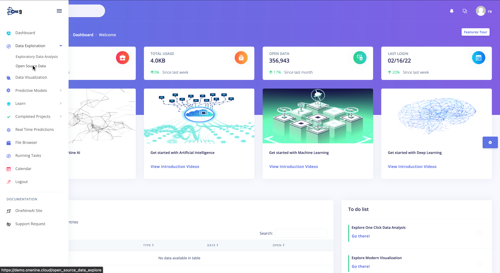
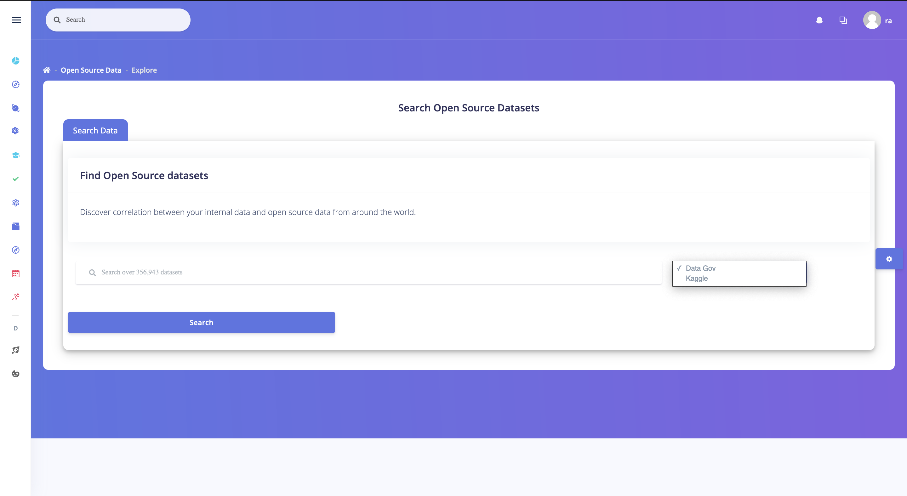
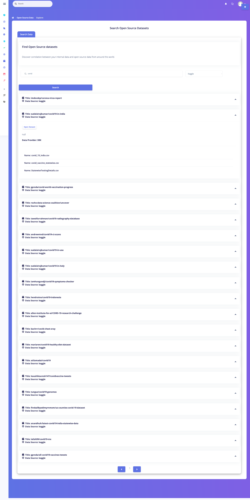

## Searching For Open Source Datasets

### 1. Head over to Discovery Projects Page from the Dashboard Sidebar.

### 2. Enter the dataset name that you want to search.

### 3. Obtain links to open source datasets.
