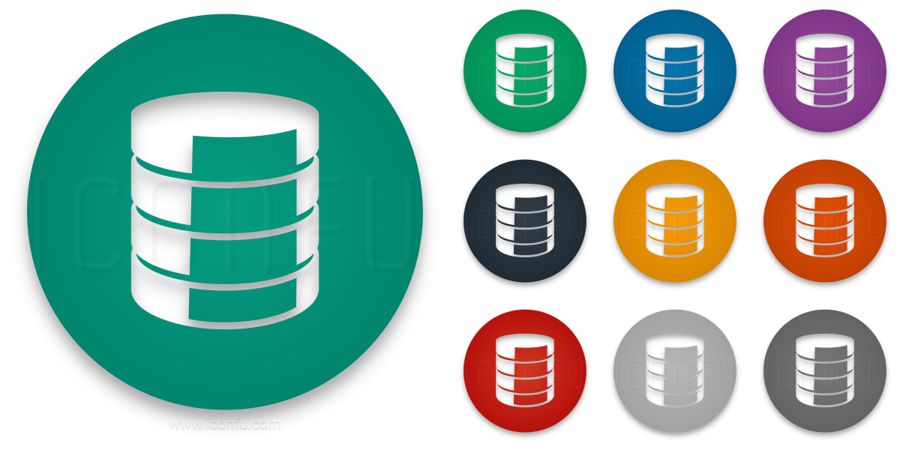

## What is an Open Source Data Repository?

 - Open data repositories are where researchers place (and discover) datasets from original research. There are repositories designed around specific disciplines and around specific data types.

 

## Types of Open Source Data Repository

### Institutional 
  - Created and Managed by the Institutional agencies.
### Disciplinary
  - Created and maintained by professional organizations or federal funding agencies.

## Data repositories we support

### [Data.gov](https://www.data.gov/)
  - Data.gov is a free and open source data repository that provides access to datasets from the U.S. government. Data.gov is the treasure-house of US government’s open data. It was only recently that the decision was made to make all government data available for free.

### [Kaggle](https://www.kaggle.com/)
  - Kaggle is great because it promotes the use of different dataset publication formats. However, the better part is that it strongly recommends that the dataset publishers share their data in an accessible, non-proprietary format. The platform supports open and accessible data formats. It is important not just for access but also for whatever you want to do with this data. 
