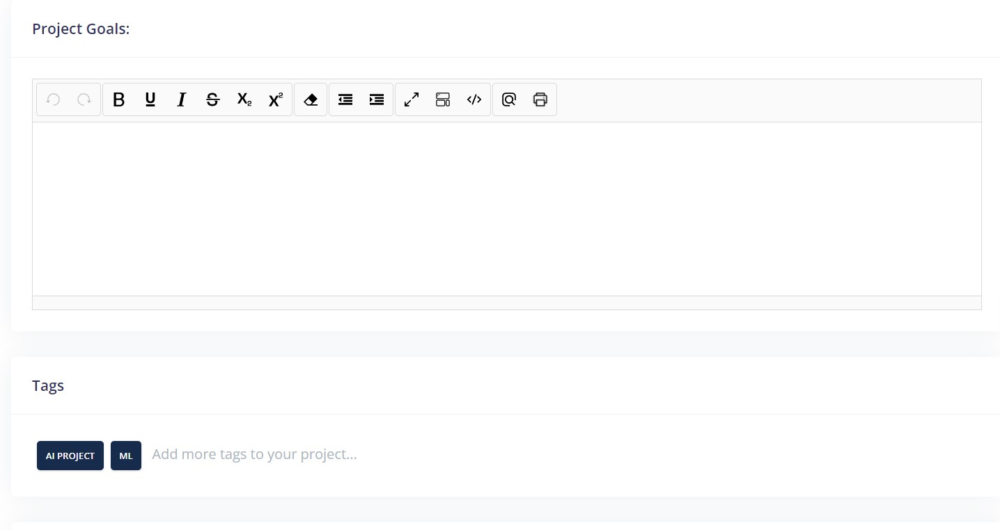

## 1. Project Naming Convention
It is always best to follow certain naming conventions while assigning a name to a project. They are listed below
1. **Keep the project names short and unique**
    - Keep the project names unique and crisp since they are more prone to appear in the URLs.
    - You can enter longer descriptions in the  `Project Goals` field (which do not build the URLs).
2. **Do not use spaces to delimit names**
    - Use capital letters or `_` or `-` to delimit words, not spaces.
    - Since the platform creates folders in the backend, having spaces in the project name might disrupt the process and an ugly `%20` might appear in the URLs
    - Do not use any other special characters such as `.`,`()`, `/`, `&`, etc.
    - *For Example*
        - SampleProjectName
        - sampleprojectname
        - Sample-Project-Name
        - sample-project-name
        - Sample_Project_Name
        - sample_project_name
3. **Add Version number if applicable**
    - While creating multiple projects using same data, you can also add version number for better reference.
    - *For Example*
        - SampleProjectNameV1
        - SampleProjectNameV2
        - SampleProjectNameV3 ... and so on

## 2. Including Project Goals and Tags
In all the four types of projects, there are fields available to add tags and project goals. The tags can be used to add a list of short keywords that correspond to the project and the longer descriptions about the project can go into the Project Goals section. 

This can help in better representation and identification of the project when it is completed.

