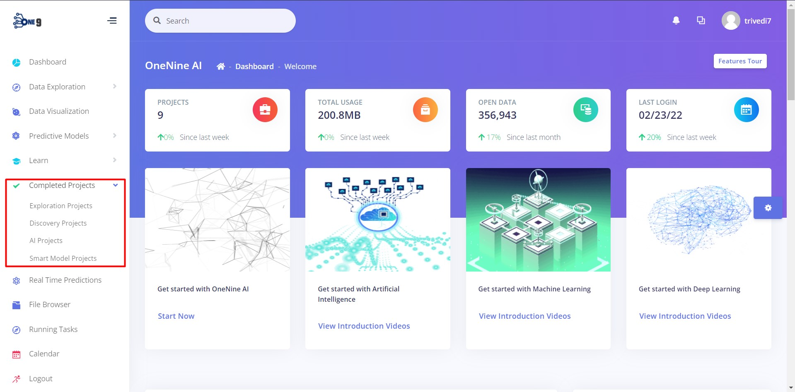
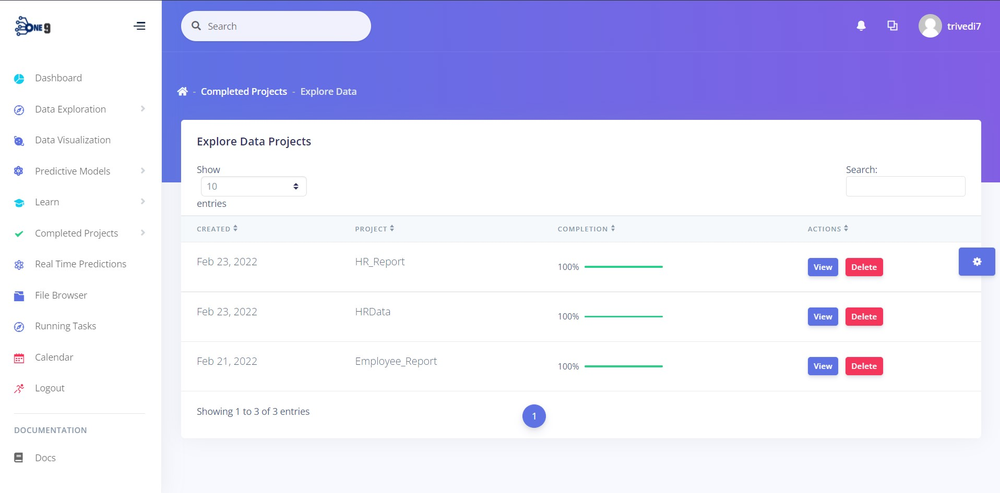
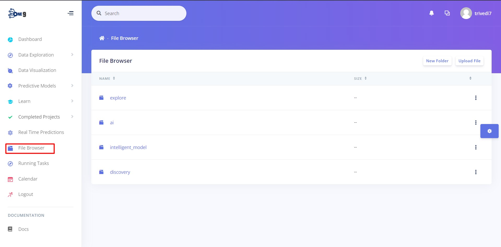
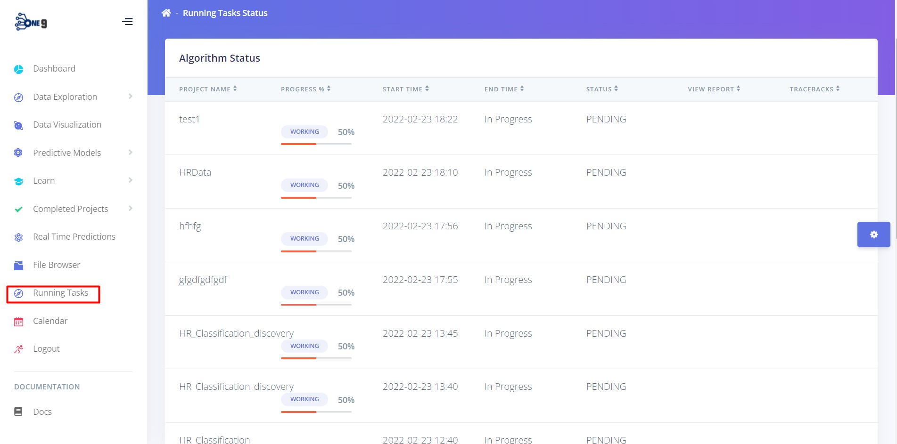

Keeping projects organized is very important while handling multiple projects. Each project might have a different purpose and the users might want to keep notes for each project. The OneNineAI platform understands these needs and provides room for these needs

## 1. Completed Projects Section

The completed projects sections list all the projects created by the user segregated by sections named after each project type. 

Under each section, all the projects created under that project type are listed in the table. It provides access to either view or delete the project

## 2. File Browser

The file browser feature helps to explore all the files uploaded by the user and the files that are created during project creation. The file browser option found in the side menu navigates to the file browser within the platform. The file browser also provides features to create new folders, upload new files, view, delete and download existing files.

## 3. Running Tasks

The Running tasks page displays all the tasks  initiated by the user in the platform and along with its status. It also keeps track of the progress, start time, end time and tracebacks of the error if the task is disrupted because of certain error.

