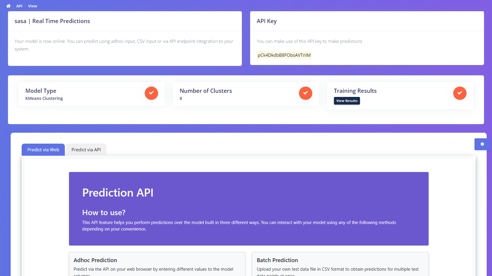

import Tabs from '@theme/Tabs';
import TabItem from '@theme/TabItem';

export const Highlight = ({children, color}) => (
  
    {children}
  
);

## Steps to create and use an API

1. Go to OneNine Platform
2. Click on <Highlight color="#5e72e4">Real Time Predictions</Highlight> in the sidebar
3. Find the project to which the API has to be created
4. Click on <Highlight color="#2dce89">Create API</Highlight> button against the desired project in the API Actions column.
5. A few seconds later, a pop up will appear which will display the API key necessary to access the API. You can use this API key to later integrate this API in your environment. Click on <Highlight color="#3085d6">OK</Highlight> to continue. 

:::caution Caution
This key is important to access the API in future. Hence please do not share it with anyone.
:::

6. You can now see the status column changing from Offline to Online. Now click on the <Highlight color="#6478e5">Use API</Highlight> button.
7. The <Highlight color="#6478e5">Use API</Highlight> button will take you to the API page where you can see the API key and a few important results of the model at the beginning. Below that, you will be able to see two tabs called `Predict via API` and `Predict via Web`.

import adhoc from '../../static/img/docs/realtime-api/pred_adhoc.png';
import batch from '../../static/img/docs/realtime-api/pred_batch.png';
import docs from '../../static/img/docs/realtime-api/docs.png';

<Tabs
  defaultValue="web"
  values={[
    {label: 'Predict via Web', value: 'web'},
    {label: 'Predict via API', value: 'api'},
  ]}>
  <TabItem value="web">
     
    The Predict via Web displays a simple UI with which you can predict the output of the model for unseen data. The primary advantage of this feature is you do not need a dedicated development team or any knowledge of API integration to use this feature. There are two ways through which you can perform predictions.
    <ol>
    <li><strong>Adhoc Predictions</strong></li>
    <li><strong>Batch Predictions</strong></li>
    </ol>
    The Adhoc predictions lets you perform one prediction at a time. As a user, you will have to enter the values for each of the input column and click on Predict. The prediction result can be seen below
     
     
    
    The Batch predictions lets you perform multiple prediction at once. It lets you upload a set of data points as a CSV file format and predictions can be performed for all the entries in the CSV file as a single batch.
    While performing batch prediction, Please keep the following in mind
    <ol>
    <li>The column names are same as those listed in the Input features section.</li>
    <li>The input file is in CSV format.</li>
    </ol>
     
    
  </TabItem>
  <TabItem value="api">
  
  This page explains all the micro details to give a robust understanding and clean user testing ability.
  The API integration document gives a detailed picture of how the API is structured. It displays information such as
    <ol>
    <li>The port in which the API is running</li>
    <li>The URLs available in the API</li>
    <li>The API Schemas</li>
    </ol>
    

  </TabItem>
</Tabs>

