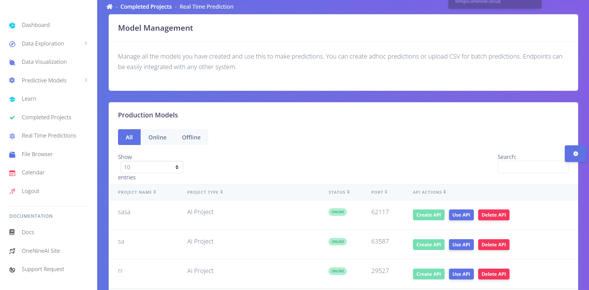

export const Highlight = ({children, color}) => (
  
    {children}
  
);

The table in the Real Time Predictions page lists all the `AI Projects` , `Discovery Wizard` and `Smart Models` created so far. 

  1. **Project Name**  
        The title of the project
  2. **Project Type**  
        Type of the project which distinguishes the project between AI , Discovery Projects and Smart Model
  3. **Status** 
        Tells if the project is Online or Offline
        - Online indicates that an API has been created already for the project and the API is up and running.
        - Offline indicates that no API has been created for the project
  4. **Port** 
          Tells on which port the API is hosted.
  5.  **Actions**
        The Actions column provides the users with three options
        - <Highlight color="#2dce89">Create API</Highlight> button creates and reserves a new port for the project
        - <Highlight color="#6478e5">Use API</Highlight> button spins up the API in the reserved port
        - <Highlight color="#f5365c">Delete API</Highlight> button deletes the reserved port. A new port can be created using the <Highlight color="#2dce89">Create API</Highlight> button if needed.

:::note 

The <Highlight color="#f5365c">Delete API</Highlight> feature is not available for Smart model APIs and will be available in the upcoming releases.

:::