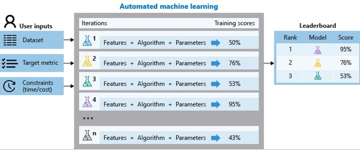

---
# Smart Models Intro
---

## What are Smart Model?
- Use case Driven, Wizard Based Interface​

- Smart enough to choose right algorithm & approach based on your data

## Automation
User selects just the column to predict​ and everything else is taken care of by us.

- Preprocessing​

- Cleaning​

- Encoding​

- Missing Data​

- Outlier Removal

