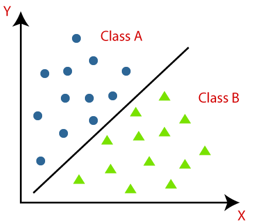
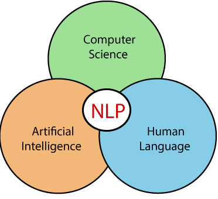

---
# Use Case driven Models
---

Currently we support 4 use cases :
1. [Classification](/docs/smart-models/use-case-driven-models#classification)
2. [Regression](/docs/smart-models/use-case-driven-models#regression)
3. [Natural Language Processing](/docs/smart-models/use-case-driven-models#natural-language-processing)
4. [Anomaly Detection](/docs/smart-models/use-case-driven-models#anomaly-detection)

## Classification
---
**What is the Classification Algorithm?**

The Classification algorithm is a Supervised Learning technique that is used to identify the category of new observations on the basis of training data. In Classification, a program learns from the given dataset or observations and then classifies new observation into a number of classes or groups. Such as, Yes or No, 0 or 1, Spam or Not Spam, cat or dog, etc. Classes can be called as targets/labels or categories.

Unlike regression, the output variable of Classification is a category, not a value, such as "Green or Blue", "fruit or animal", etc. Since the Classification algorithm is a Supervised learning technique, hence it takes labeled input data, which means it contains input with the corresponding output.

The main goal of the Classification algorithm is to identify the category of a given dataset, and these algorithms are mainly used to predict the output for the categorical data.

## Regression
---
**What is the Regression Algorithm?**

Regression analysis is a statistical method to model the relationship between a dependent (target) and independent (predictor) variables with one or more independent variables. More specifically, Regression analysis helps us to understand how the value of the dependent variable is changing corresponding to an independent variable when other independent variables are held fixed. It predicts continuous/real values such as temperature, age, salary, price, etc.

Regression is a supervised learning technique which helps in finding the correlation between variables and enables us to predict the continuous output variable based on the one or more predictor variables. It is mainly used for prediction, forecasting, time series modeling, and determining the causal-effect relationship between variables.

### Differences between Regression and Classification
| Regression | Classification |
| ------------------- | --------------------- |
| In Regression, the output variable must be of continuous nature or real value. | In Classification, the output variable must be a discrete value. |
| The task of the regression algorithm is to map the input value (x) with the continuous output variable(y). | The task of the classification algorithm is to map the input value(x) with the discrete output variable(y). |
| Regression Algorithms are used with continuous data. | Classification Algorithms are used with discrete data. |
| In Regression, we try to find the best fit line, which can predict the output more accurately. | In Classification, we try to find the decision boundary, which can divide the dataset into different classes. |
| Regression algorithms can be used to solve the regression problems such as Weather Prediction, House price prediction, etc. | Classification Algorithms can be used to solve classification problems such as Identification of spam emails, Speech Recognition, Identification of cancer cells, etc. |
| The regression Algorithm can be further divided into Linear and Non-linear Regression. | The Classification algorithms can be divided into Binary Classifier and Multi-class Classifier. |

## Natural Language Processing
---
**What is Natural Language Processing?**

NLP stands for Natural Language Processing, which is a part of Computer Science, Human language, and Artificial Intelligence. It is the technology that is used by machines to understand, analyse, manipulate, and interpret human's languages. It helps developers to organize knowledge for performing tasks such as translation, automatic summarization, Named Entity Recognition (NER), speech recognition, relationship extraction, and topic segmentation.

- NLP helps users to ask questions about any subject and get a direct response within seconds.
- NLP offers exact answers to the question means it does not offer unnecessary and unwanted information.
- NLP helps computers to communicate with humans in their languages.
- It is very time efficient.
- Most of the companies use NLP to improve the efficiency of documentation processes, accuracy of documentation, and identify the information from large databases.

&nbsp; &nbsp; &nbsp; &nbsp; &nbsp; &nbsp; &nbsp; &nbsp; &nbsp;&nbsp; &nbsp; &nbsp; &nbsp; &nbsp; &nbsp; &nbsp; &nbsp; &nbsp; 

## Anomaly Detection
---
**What is Anomaly Detection?**

Anomaly detection is a process of finding those rare items, data points, events, or observations that make suspicions by being different from the rest data points or observations. Anomaly detection is also known as outlier detection.

Generally, anomalous data is related to some kind of problems such as bank fraud, medical problems, malfunctioning equipment, etc.

Finding an anomaly is the ability to define what is normal? For example, in the below image, the yellow vehicle is an anomaly among all red vehicles.

